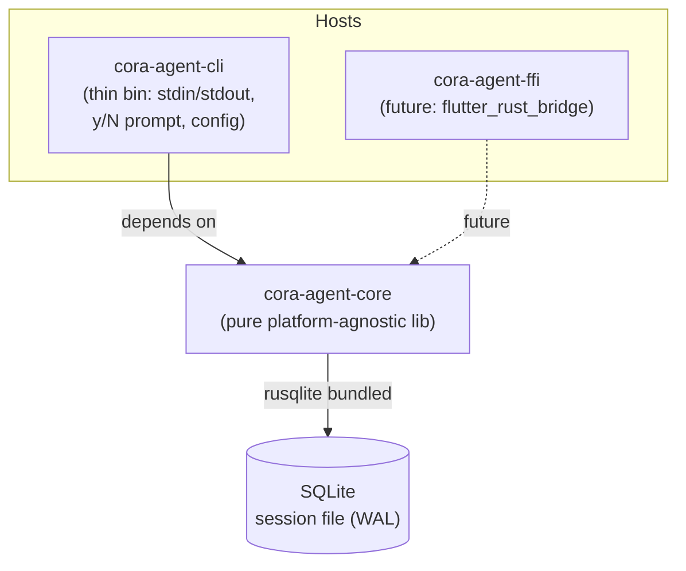
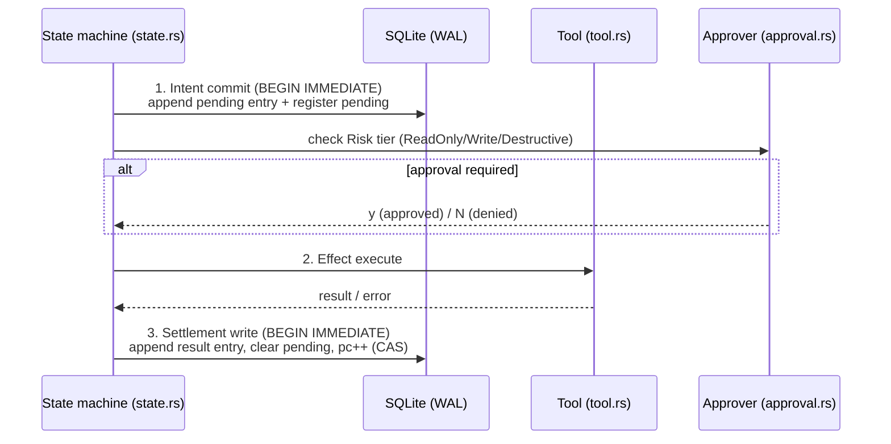

# cora-agent — Architecture Document

> Status: Ground truth Phase 1–2. Written in English, technical terms kept as-is.
> Crate layout: `crates/cora-agent-core` (pure lib) + `crates/cora-agent-cli` (thin host bin). Future: `cora-agent-ffi`.

## 1. Design Principles

1. **Durability first** — all state that determines agent behavior must survive a crash. A single SQLite file per session is the single source of truth.
2. **Write-once** — the conversation tree is append-only & immutable. No entry update/delete; corrections = new entries.
3. **Pure core** — `cora-agent-core` performs no interactive I/O (stdin/stdout/CLI). Embeddable via CLI, Corin (Tauri), or `flutter_rust_bridge` FFI.
4. **Portable Phase 1–2** — no *nix-only dependencies. Cross-build CI deferred to Phase 3.

## 2. Crate Layout & Dependencies

- **cora-agent-core** — platform-agnostic library. No stdin/stdout/CLI assumptions. All host interactions (approval prompt, output streaming) go through trait boundaries (`Approver`, etc.).
- **cora-agent-cli** — thin host binary: parse config, wire up `InteractiveApprover` (y/N prompt on the host), run the turn loop from core.
- **cora-agent-ffi** (future) — FFI binding for embedding in Corin / Flutter.

## 3. Module Responsibility

| Module | File | Responsibility |
|---|---|---|
| Durable storage | (session db) | SQLite single file per session; rusqlite bundled; WAL mode; all writes inside `BEGIN IMMEDIATE`; migrate-on-open with `STORAGE_VERSION` const |
| Conversation tree | `entry.rs` | Append-only, immutable entries (user/assistant/tool/final). Write-once; safe to replay |
| Registers | `register.rs` | Namespaced mutable cells: `lane`, `op`, `pending`, `fact`. The namespace determines lifecycle & cleanup semantics |
| State machine | `state.rs` | Program counter + seq CAS for atomic transitions; guarantees no double-advance / lost transitions |
| Tools | `tool.rs` | `Tool` trait with `Risk` tiers: `ReadOnly` / `Write` / `Destructive`; registry & dispatch |
| Approval | `approval.rs` | `Approver` trait; impls `AllowlistApprover` (config-driven, lives in core) + `InteractiveApprover` (y/N prompt — in the **host**, not core) |
| Provider | `provider.rs` | Thin `Provider` trait (LLM call abstraction). Phase 1: hand-rolled impl. Phase 2: evaluate `rig` (MIT) — if adopted, wrapped inside this single module boundary only |
| Session/orchestrator | (session) | Single-threaded turn loop; coordinates the state machine, effect sandwich, tool dispatch |

## 4. Data Model (SQLite Tables)

Single file per session (`<session-id>.db`), WAL mode.

| Table | Core columns | Nature |
|---|---|---|
| `meta` | `key`, `value` — includes `storage_version` (`STORAGE_VERSION` const) | migrate-on-open; schema versioning |
| `entries` | `id` (monotonic), `parent_id`, `kind` (user/assistant/tool/final), `payload`, `created_at` | **Append-only, immutable.** Conversation tree via `parent_id` |
| `registers` | `namespace` (`lane`/`op`/`pending`/`fact`), `name`, `value`, `updated_at` | Mutable, upsert per (namespace, name) |
| `state` | `id` (singleton), `pc` (program counter), `seq`, `status` | Transition via CAS on `seq` |

Invariants:
- All writes go through `BEGIN IMMEDIATE` transactions (explicit write lock, avoids SQLITE_BUSY upgrade deadlock).
- `entries` are never UPDATEd/DELETEd — corrections/errors = append a new entry.
- `state.seq` is monotonic; a transition is valid only if `seq == expected`.

## 5. State Machine

The program counter (`pc`) determines the next step. Transitions are guarded by **seq CAS**: read `(pc, seq)` → compute next → `UPDATE ... WHERE seq = :expected` → if 0 rows affected, retry/abort (race detected).

## 6. Effect Sandwich

Every tool execution follows a three-layer pattern — a crash at any point can be recovered deterministically:

1. **Intent commit** — append `pending` entry (intent) + set `pending` register → SQLite. Crash-safe: on resume, a pending entry without settlement → tool is **replay-safe** or considered failed.
2. **Effect execute** — run the tool outside the DB transaction (real-world side effect).
3. **Settlement write** — append result entry (success/error) + clear `pending` register + advance `pc` via CAS.

Per-tool **replay safety** must be declared on the `Tool` trait (idempotent / non-idempotent-with-guard / never-replay).

## 7. Tool & Approval

- `Tool` trait: `name()`, `spec()`, `risk() -> Risk`, `execute(input) -> Output`. `Risk`:
  - `ReadOnly` — may run without approval.
  - `Write` — requires approval unless it matches the allowlist.
  - `Destructive` — always requires approval (allowlist may explicitly opt in).
- `Approver` trait: `approve(request) -> Decision`. Impls:
  - `AllowlistApprover` — from config (runs in core, deterministic, testable).
  - `InteractiveApprover` — y/N prompt. **Lives in the host (CLI)**, not in core — core only receives the trait impl via injection.

## 8. Provider

- Phase 1: thin `Provider` trait (send completion, streaming optional). Minimal hand-rolled implementation.
- Phase 2: evaluate **rig** (MIT). If adopted, all rig usage is wrapped inside a single module boundary (`provider.rs`) so the core's public traits remain unchanged and swapping stays cheap.

## 9. Concurrency Model

- **Single-threaded turn loop.** One session = one execution thread; no parallel tool calls in Phase 1.
- SQLite as the serialization point: WAL allows concurrent readers (UI/host preview) without blocking the writer.
- CAS on `state.seq` protects against double-drive (e.g. resume + host race) — only one wins, the other retries/aborts.

## 10. Error Handling Strategy

- All fallible operations return `Result<T, CoreError>`; error enums centralized per-module with `thiserror`-style (no panics in core).
- **Storage error** → abort the turn, session stays consistent (atomic transactions). No partial writes.
- **Effect error** → append an error entry (settlement), state machine returns to Planning; never panics out of the turn loop.
- **Approval denied** → not an error; append entry + replan.
- **Corrupt/mismatched `STORAGE_VERSION`** → refuse to open with a clear error (no auto-downgrade); migrations are forward-only, run at open.
- The host (CLI) is responsible for displaying errors & exit codes; core never prints.

## 11. Testing Strategy

| Tier | Scope | Examples |
|---|---|---|
| **A — Unit** | State machine & storage | CAS transition (race → 0 rows affected), migrate-on-open, register upsert per namespace, entry append immutability, `BEGIN IMMEDIATE` write path |
| **B — Integration** | Crash-resume | Kill at the three points of the effect sandwich (after intent / during effect / before settlement) → resume produces the settlement exactly once (per tool replay-safety contract) |
| **C — Adversarial** | Malicious input & abuse | Giant tool output, malformed tool args, approval spam, double-drive turn loop, state.seq collision, storage version mismatch, allowlist bypass patterns |

## 12. Phase Rules

- Phase 1–2: **no *nix-only deps** — all crates must build on portable targets (Windows/macOS/Linux). Cross-build CI deferred to Phase 3.
- The future `cora-agent-ffi` may only depend on core, and must not contain domain logic.
