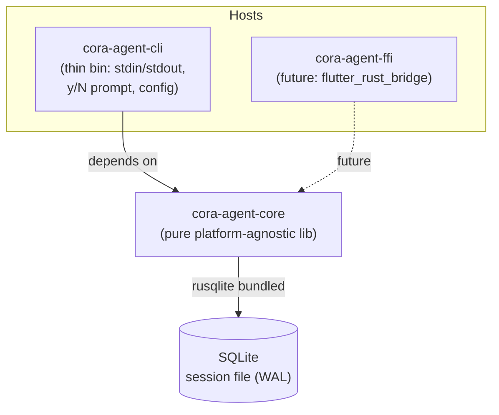
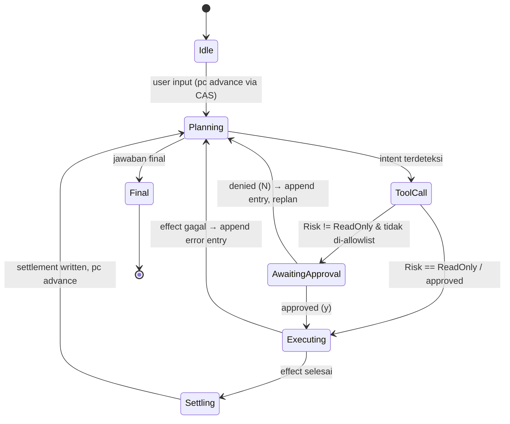
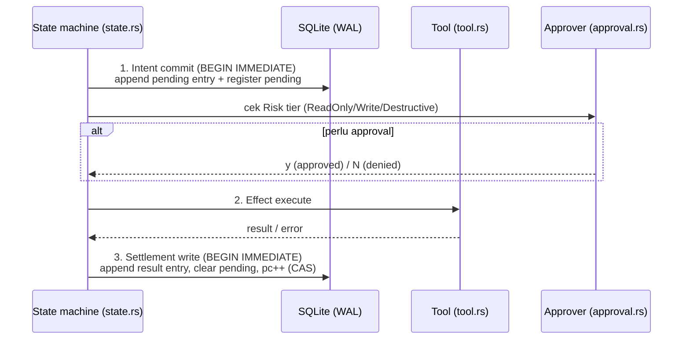

# cora-agent — Architecture Document

> Status: Ground truth Phase 1–2. Bahasa Indonesia, istilah teknis English.
> Crate layout: `crates/cora-agent-core` (pure lib) + `crates/cora-agent-cli` (thin host bin). Future: `cora-agent-ffi`.

## 1. Prinsip Desain

1. **Durability first** — semua state yang menentukan perilaku agent harus survive crash. SQLite single file per session adalah satu-satunya source of truth.
2. **Write-once** — conversation tree append-only & immutable. Tidak ada update/delete entry; koreksi = entry baru.
3. **Core murni** — `cora-agent-core` tidak melakukan I/O interaktif (stdin/stdout/CLI). Embeddable via CLI, Corin (Tauri), atau `flutter_rust_bridge` FFI.
4. **Portabel Phase 1–2** — tidak ada dependency *nix-only. Cross-build CI defer ke Phase 3.

## 2. Crate Layout & Dependency

- **cora-agent-core** — platform-agnostic library. Tidak ada asumsi stdin/stdout/CLI. Semua interaksi host (approval prompt, output streaming) lewat trait boundary (`Approver`, dsb.).
- **cora-agent-cli** — thin host binary: parse config, wiring `InteractiveApprover` (prompt y/N di host), jalankan turn loop dari core.
- **cora-agent-ffi** (future) — FFI binding untuk embedding di Corin / Flutter.

## 3. Module Responsibility

| Module | File | Tanggung Jawab |
|---|---|---|
| Durable storage | (session db) | SQLite single file per session; rusqlite bundled; WAL mode; semua write dalam `BEGIN IMMEDIATE`; migrate-on-open dengan `STORAGE_VERSION` const |
| Conversation tree | `entry.rs` | Append-only, immutable entries (user/assistant/tool/final). Write-once; replay aman |
| Registers | `register.rs` | Namespaced mutable cells: `lane`, `op`, `pending`, `fact`. Namespace menentukan lifecycle & cleanup semantics |
| State machine | `state.rs` | Program counter + seq CAS untuk transition atomik; menjamin tidak ada double-advance / lost transition |
| Tools | `tool.rs` | `Tool` trait dengan `Risk` tier: `ReadOnly` / `Write` / `Destructive`; registry & dispatch |
| Approval | `approval.rs` | `Approver` trait; impl `AllowlistApprover` (config-driven, ada di core) + `InteractiveApprover` (y/N prompt — di **host**, bukan core) |
| Provider | `provider.rs` | `Provider` trait tipis (LLM call abstraction). Phase 1: hand-rolled impl. Phase 2: evaluasi `rig` (MIT) — jika diadopsi, di-wrap di satu module boundary ini saja |
| Session/orchestrator | (session) | Turn loop single-threaded; mengkoordinasikan state machine, effect sandwich, tool dispatch |

## 4. Data Model (SQLite Tables)

Single file per session (`<session-id>.db`), WAL mode.

| Table | Kolom (inti) | Sifat |
|---|---|---|
| `meta` | `key`, `value` — termasuk `storage_version` (`STORAGE_VERSION` const) | migrate-on-open; schema versioning |
| `entries` | `id` (monotonic), `parent_id`, `kind` (user/assistant/tool/final), `payload`, `created_at` | **Append-only, immutable.** Conversation tree via `parent_id` |
| `registers` | `namespace` (`lane`/`op`/`pending`/`fact`), `name`, `value`, `updated_at` | Mutable, upsert per (namespace, name) |
| `state` | `id` (singleton), `pc` (program counter), `seq`, `status` | Transition via CAS pada `seq` |

Invariant:
- Semua write lewat transaksi `BEGIN IMMEDIATE` (write lock eksplisit, hindari SQLITE_BUSY upgrade deadlock).
- `entries` tidak pernah di-UPDATE/DELETE — koreksi/error = append entry baru.
- `state.seq` monotonic; transition valid hanya jika `seq == expected`.

## 5. State Machine

Program counter (`pc`) menentukan langkah berikutnya. Transition dilindungi **seq CAS**: read `(pc, seq)` → hitung next → `UPDATE ... WHERE seq = :expected` → jika 0 row affected, retry/abort (race terdeteksi).

## 6. Effect Sandwich

Setiap eksekusi tool mengikuti pola tiga lapis — crash di titik mana pun dapat direcover secara deterministik:

1. **Intent commit** — append entry `pending` (intent) + set register `pending` → SQLite. Tahan crash: saat resume, entry pending tanpa settlement → tool **replay-safe** atau dianggap gagal.
2. **Effect execute** — jalankan tool di luar transaksi DB (side effect dunia nyata).
3. **Settlement write** — append entry hasil (success/error) + clear register `pending` + advance `pc` via CAS.

Per-tool **replay safety** wajib dideklarasikan di `Tool` trait (idempotent / non-idempotent-with-guard / never-replay).

## 7. Tool & Approval

- `Tool` trait: `name()`, `spec()`, `risk() -> Risk`, `execute(input) -> Output`. `Risk`:
  - `ReadOnly` — boleh jalan tanpa approval.
  - `Write` — perlu approval kecuali match allowlist.
  - `Destructive` — selalu perlu approval (allowlist bisa opt-in eksplisit).
- `Approver` trait: `approve(request) -> Decision`. Impl:
  - `AllowlistApprover` — dari config (berjalan di core, deterministik, testable).
  - `InteractiveApprover` — y/N prompt. **Berada di host (CLI)**, bukan di core — core hanya menerima impl trait via injection.

## 8. Provider

- Phase 1: `Provider` trait tipis (send completion, streaming optional). Implementasi hand-rolled minimal.
- Phase 2: evaluasi **rig** (MIT). Jika diadopsi, semua penggunaan rig di-wrap di satu module boundary (`provider.rs`) agar trait publik core tidak berubah dan swap tetap murah.

## 9. Concurrency Model

- **Single-threaded turn loop.** Satu session = satu thread eksekusi; tidak ada parallel tool call di Phase 1.
- SQLite sebagai serialization point: WAL memungkinkan reader (UI/host preview) concurrent tanpa memblokir writer.
- CAS pada `state.seq` melindungi dari double-drive (mis. resume + host race) — hanya satu yang menang, yang lain retry/abort.

## 10. Error Handling Strategy

- Semua fallible operation mengembalikan `Result<T, CoreError>`; error enum terpusap per-module dengan `thiserror`-style (non-panic di core).
- **Storage error** → abort turn, session tetap konsisten (transaksi atomik). Tidak ada partial write.
- **Effect error** → append entry error (settlement), state machine kembali ke Planning; tidak pernah panic keluar turn loop.
- **Approval denied** → bukan error; append entry + replan.
- **Corrupt/mismatched `STORAGE_VERSION`** → refuse open dengan error jelas (tidak auto-downgrade); migrasi hanya forward, run saat open.
- Host (CLI) bertanggung jawab menampilkan error & exit code; core tidak print.

## 11. Testing Strategy

| Tier | Scope | Contoh |
|---|---|---|
| **A — Unit** | State machine & storage | CAS transition (race → 0 row affected), migrate-on-open, register upsert per namespace, entry append immutability, `BEGIN IMMEDIATE` write path |
| **B — Integration** | Crash-resume | Kill di tiga titik effect sandwich (setelah intent / saat effect / sebelum settlement) → resume menghasilkan settlement tepat satu kali (per tool replay-safety contract) |
| **C — Adversarial** | Input jahat & abuse | Tool output raksasa, malformed tool args, approval spam, double-drive turn loop, state.seq collision, storage version mismatch, allowlist bypass pattern |

## 12. Phase Rules

- Phase 1–2: **no *nix-only deps** — semua crate harus build di target portabel (Windows/macOS/Linux). Cross-build CI defer Phase 3.
- Future `cora-agent-ffi` hanya boleh bergantung pada core, tidak mengandung logika domain.
