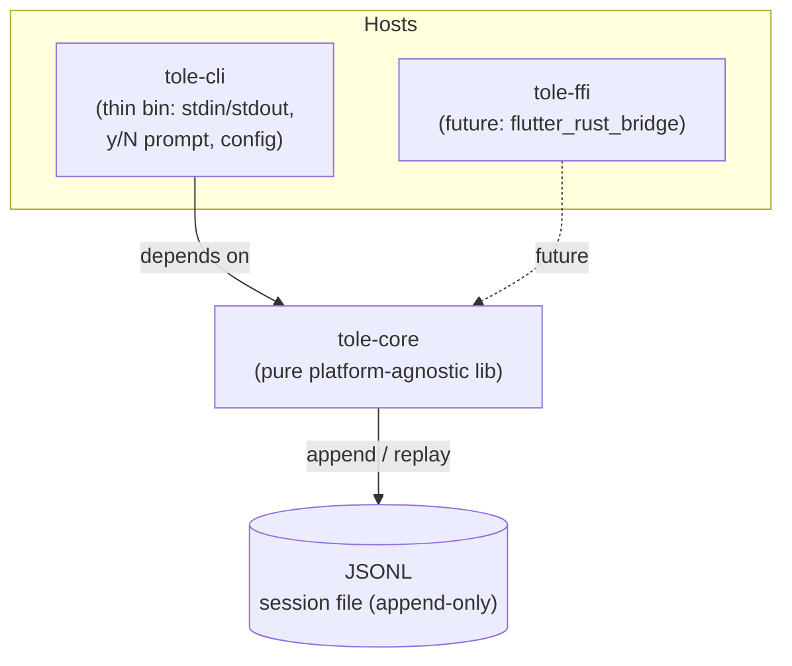
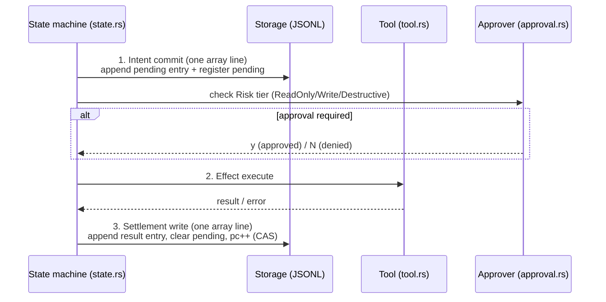

# tole — Architecture Document

> Status: Ground truth Phase 1–2. Written in English, technical terms kept as-is.
> Crate layout: `crates/tole-core` (pure lib) + `crates/tole-cli` (thin host bin). Future: `tole-ffi`.

## 1. Design Principles

1. **Durability first** — all state that determines agent behavior must survive a crash. The session file (JSONL, default) is the single source of truth.
2. **Write-once** — the conversation tree is append-only & immutable. No entry update/delete; corrections = new entries.
3. **Pure core** — `tole-core` performs no interactive I/O (stdin/stdout/CLI). Embeddable via CLI, Corin (Tauri), or `flutter_rust_bridge` FFI.
4. **Portable Phase 1–2** — no *nix-only dependencies. Cross-build CI deferred to Phase 3.

## 2. Crate Layout & Dependencies



- **tole-core** — platform-agnostic library. No stdin/stdout/CLI assumptions. All host interactions (approval prompt, output streaming) go through trait boundaries (`Approver`, etc.).
- **tole-cli** — thin host binary: parse config, wire up `InteractiveApprover` (y/N prompt on the host), run the turn loop from core.
- **tole-ffi** (future) — FFI binding for embedding in Corin / Flutter.

## 3. Module Responsibility

| Module | File | Responsibility |
|---|---|---|
| Durable storage | (session file) | JSONL single file per session (default, industry pattern — Claude Code/Codex/pi); append-only commits; optional SQLite backend behind same `Storage` trait (feature-gated) |
| Conversation tree | `entry.rs` | Append-only, immutable entries (user/assistant/tool/final). Write-once; safe to replay |
| Registers | `register.rs` | Namespaced mutable cells: `lane`, `op`, `pending`, `fact`. The namespace determines lifecycle & cleanup semantics |
| State machine | `state.rs` | Program counter + seq CAS for atomic transitions; guarantees no double-advance / lost transitions |
| Tools | `tool.rs` | `Tool` trait with `Risk` tiers: `ReadOnly` / `Write` / `Destructive`; registry & dispatch |
| Approval | `approval.rs` | `Approver` trait; impls `AllowlistApprover` (config-driven, lives in core) + `InteractiveApprover` (y/N prompt — in the **host**, not core) |
| Provider | `provider.rs` | Thin `Provider` trait (LLM call abstraction). Phase 1: hand-rolled impl. Phase 2: evaluate `rig` (MIT) — if adopted, wrapped inside this single module boundary only |
| Session/orchestrator | (session) | Single-threaded turn loop; coordinates the state machine, effect sandwich, tool dispatch |

## 4. Data Model — Storage Backends

**Default: one JSONL file per session (`<session-id>.jsonl`)** — following the pattern proven by Claude Code, Codex (rollout files), and pi (JSONL backend). Optional SQLite backend lives behind the same `Storage` trait for query-heavy consumers.

**Why JSONL as default (industry pattern):**
- Append-only, O(1) per commit — no WAL, no lock management, no `BEGIN IMMEDIATE` discipline
- Crash safety: a torn final line is discarded whole; process-crash durability per resolved commit
- One file per session → corruption isolated, deletion = unlink, trivially debuggable (`cat`/`grep`/`jq`)
- The file is a **replay recipe**, not the state: open replays lines into in-memory maps; all queries run in RAM
- Write history is audit-friendly; compaction (rewrite via temp file + atomic rename) is optional and only when dead-bytes ratio crosses a threshold

**Line format (one physical line per commit; array line groups one transaction):**

```jsonl
{"v":1,"kind":"header","id":"<session-id>","storageVersion":1,"createdAt":...,"cwd":"..."}
[{"kind":"entry","seq":101,"timestamp":...,"id":"e_50","parentId":"e_41","type":"message","payload":{...}},
 {"kind":"register","op":"set","seq":102,"namespace":"op.state","key":"op_9","value":{...}},
 {"kind":"register","op":"set","seq":103,"namespace":"lane.leaf","key":"main","value":"e_50"}]
{"kind":"usage","seq":110,"id":"u_7","entryId":"e_51","usage":{...}}
{"kind":"register","op":"delete","seq":131,"namespace":"op.state","key":"op_9"}
```

**Logical model (identical across backends):**

| Form | Nature |
|---|---|
| `entries` | **Append-only, immutable** conversation tree: `id`, `parentId`, `seq`, `kind`, `payload`, `timestamp` |
| `registers` | Namespaced mutable cells (`lane` / `op` / `pending` / `fact`), overwritten per key on `set`, removed on `delete` |
| `usage` ledger | Append-only cost rows per provider attempt |
| `state` | Singleton register: `pc` (program counter), `seq` — transition via CAS on `seq` |

Invariants (all backends):
- On open, lines replay in order; persisted `seq` must be strictly increasing (gaps legal — compaction drops dead lines and gaps are permitted).
- `entries` are never modified or deleted — corrections = append a new entry. Registers are the only mutable state.
- `state.seq` is monotonic; a transition is valid only if `seq == expected`.

**Optional SQLite backend** (`feature = "sqlite"`): one `.db` file per session, WAL mode, all writes via `BEGIN IMMEDIATE`; same 3-store schema (entries WITHOUT ROWID + registers + usage_ledger). Chosen only when consumers need indexed queries (e.g. branch index scans); not used by the CLI in v0.

## 5. State Machine

The program counter (`pc`) determines the next step. Transitions are guarded by **seq CAS**: read `(pc, seq)` → compute next → `UPDATE ... WHERE seq = :expected` → if 0 rows affected, retry/abort (race detected).


## 6. Effect Sandwich

Every tool execution follows a three-layer pattern — a crash at any point can be recovered deterministically:

1. **Intent commit** — append `pending` entry (intent) + set `pending` register → one atomic commit line. Crash-safe: on resume, a pending entry without settlement → tool is **replay-safe** or considered failed.
2. **Effect execute** — run the tool outside the DB transaction (real-world side effect).
3. **Settlement write** — append result entry (success/error) + clear `pending` register + advance `pc` via CAS.

Per-tool **replay safety** must be declared on the `Tool` trait (idempotent / non-idempotent-with-guard / never-replay).



## 7. Tool & Approval

- `Tool` trait: `name()`, `spec()`, `risk() -> Risk`, `execute(input) -> Output`. `Risk`:
  - `ReadOnly` — may run without approval.
  - `Write` — requires approval unless it matches the allowlist.
  - `Destructive` — always requires approval (allowlist may explicitly opt in).
- `Approver` trait: `approve(request) -> Decision`. Impls:
  - `AllowlistApprover` — from config (runs in core, deterministic, testable).
  - `InteractiveApprover` — y/N prompt. **Lives in the host (CLI)**, not in core — core only receives the trait impl via injection.

## 8. Provider

- Phase 1: thin `Provider` trait (send completion, streaming optional). Minimal hand-rolled implementation.
- Phase 2: evaluate **rig** (MIT). If adopted, all rig usage is wrapped inside a single module boundary (`provider.rs`) so the core's public traits remain unchanged and swapping stays cheap.

## 9. Concurrency Model

- **Single-threaded turn loop.** One session = one execution thread; no parallel tool calls in Phase 1.
- SQLite as the serialization point (optional backend): WAL allows concurrent readers (UI/host preview) without blocking the writer. The default JSONL backend serializes naturally (one append at a time; readers tail the file).
- CAS on `state.seq` protects against double-drive (e.g. resume + host race) — only one wins, the other retries/aborts.

## 10. Error Handling Strategy

- All fallible operations return `Result<T, CoreError>`; error enums centralized per-module with `thiserror`-style (no panics in core).
- **Storage error** → abort the turn, session stays consistent (atomic transactions). No partial writes.
- **Effect error** → append an error entry (settlement), state machine returns to Planning; never panics out of the turn loop.
- **Approval denied** → not an error; append entry + replan.
- **Corrupt/mismatched `STORAGE_VERSION`** → refuse to open with a clear error (no auto-downgrade); migrations are forward-only, run at open.
- The host (CLI) is responsible for displaying errors & exit codes; core never prints.

## 11. Testing Strategy

| Tier | Scope | Examples |
|---|---|---|
| **A — Unit** | State machine & storage | CAS transition (seq race → mismatch), format version check on open, register upsert per namespace, entry append immutability, torn-last-line discard on replay |
| **B — Integration** | Crash-resume | Kill at the three points of the effect sandwich (after intent / during effect / before settlement) → resume produces the settlement exactly once (per tool replay-safety contract) |
| **C — Adversarial** | Malicious input & abuse | Giant tool output, malformed tool args, approval spam, double-drive turn loop, state.seq collision, storage version mismatch, allowlist bypass patterns |

## 12. Phase Rules

- Phase 1–2: **no *nix-only deps** — all crates must build on portable targets (Windows/macOS/Linux). Cross-build CI deferred to Phase 3.
- The future `tole-ffi` may only depend on core, and must not contain domain logic.
